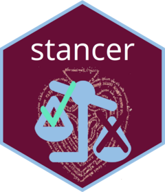

<!-- README.md is generated from README.Rmd. Please edit that file -->

```{r, include = FALSE}
knitr::opts_chunk$set(
  collapse = TRUE,
  comment = "#>",
  fig.path = "man/figures/README-",
  out.width = "100%"
)
```

# stancer 

<!-- badges: start -->
[](https://github.com/Marwolaeth/stancer/actions/workflows/R-CMD-check.yaml)
[](https://app.codecov.io/gh/Marwolaeth/stancer)
<!-- badges: end -->

Stance Analysis using Ensemble of LLM Agents through `ellmer`

## Overview

**stancer** provides tools for automated stance analysis in R. It uses an ensemble of Large Language Models (LLM) to determine whether a text is in favour of, against, or neutral towards a specific target.

The package is built upon the **COLA** (Collaborative rOle-infused LLM-based Agents) framework proposed by @lan2024stancedetectioncollaborativeroleinfused. Instead of a single prompt, `stancer` coordinates a team of LLM agents—linguists, domain experts, and social media specialists—who analyse the text and debate its meaning before reaching a final judgement.

## Installation

You can install the development version of stancer from [GitHub](https://github.com/) with:

``` r
# install.packages("pak")
pak::pak("Marwolaeth/stancer")
```

## How it works: The COLA Framework

Following the approach by @lan2024stancedetectioncollaborativeroleinfused, `stancer` breaks down stance detection into three distinct stages:

1.  **Multidimensional Analysis**: Three specialised agents (Linguistic, Domain, and Social) analyse the text's style, terminology, and context.
2.  **Reasoning-Enhanced Debate**: For each possible stance (Positive/Neutral/Negative), an agent is assigned to argue why the text might fit that category. This helps uncover implicit viewpoints that a simple analysis might miss.
3.  **Stance Conclusion**: A final decision-maker reviews the analyses and the debate to provide a reasoned judgement and a final score.

## Supported Languages

`stancer` includes built-in, hand-crafted prompts for the following languages:

- **English** (`"en"`)
- **Ukrainian** (`"uk"`)
- **Russian** (`"ru"`)

The package automatically detects the language of your text (using `cld2` if available) or allows you to specify it manually in `llm_stance()`.

## Usage

`stancer` works with chat objects from the [ellmer](https://ellmer.tidyverse.org/) package. This gives you the flexibility to use any supported model (OpenAI, Anthropic, Ollama, etc.) as your analysis engine.

### Simple text analysis

```r
library(stancer)
library(ellmer)

# Set up your LLM client
chat <- ellmer::chat_anthropic()

text <- "The carbon tax is just another way for the government to control our lives and stifle economic growth."
target <- "Climate Change mitigation policies"

result <- llm_stance(
  text,
  target,
  type = "object", # stance towards a given object or entity 
  # type = "statement", # whether a text agrees with a certain statement
  chat_base = chat,
  domain_role = "economic analyst"
)

# View the summary
summary(result)
as.data.frame(result)
inspect(result, "analysis", "linguistic")
```

### Data frame integration (mall-style)

Inspired by the [mall](https://mlverse.github.io/mall/) package, `stancer` provides a seamless way to process entire datasets. It handles the row-wise operations and returns a tidy data frame with the results.

```r
library(stancer)
library(ellmer)
library(dplyr)

data("programming_tweets")

chat <- ellmer::chat_anthropic()

# Process the first three rows of the data frame
results <- programming_tweets |>
    dplyr::slice_head(n = 3) |>
    llm_stance(
        tweet,
        target = "Julia programming language",
        type = "object",
        chat = chat,
        domain_role = "computer scientis",
        language = "en",
        scale = "categorical"
    )

# The result is a tibble with a new .stance column
glimpse(results)
```

```
## Rows: 3
## Columns: 2
## $ tweet   <chr> "Julia's SciML ecosystem is absolutely phenomenal for solving complex differential equations. The performance and expressiveness combined i…
## $ .stance <fct> Positive, Positive, Positive
```

### Customizing Prompts

If you need to adapt the agents' behaviour, support a new language, or you find that the original prompts are too verbose and slow, you can provide your own instructions. By using the `prompts_dir` argument, you can point the package to a local folder containing custom `.md` files.

`stancer` will look for specific files (e.g., `user-linguist.md`, `system-judger.md`, `description-likert.md`) in that directory. If a file is missing, the package will gracefully fall back to its internal defaults with respect to the `language` argument (`"en"` by default). This allows you to override the system partially or entirely.

```r
# Use custom instructions from a local folder
result <- llm_stance(
  text,
  target,
  type = "object",
  chat_base = chat,
  prompts_dir = "path/to/my_prompts/"
)
```


## Requirements

- R >= 4.1.0
- [ellmer](https://ellmer.tidyverse.org/) for LLM integration.
- API access to your chosen LLM provider.

## Citation & Attribution

This implementation is based on the COLA framework from @lan2024stancedetectioncollaborativeroleinfused.

When using this package, please cite the original COLA paper.

## References

::: {#refs}
:::
